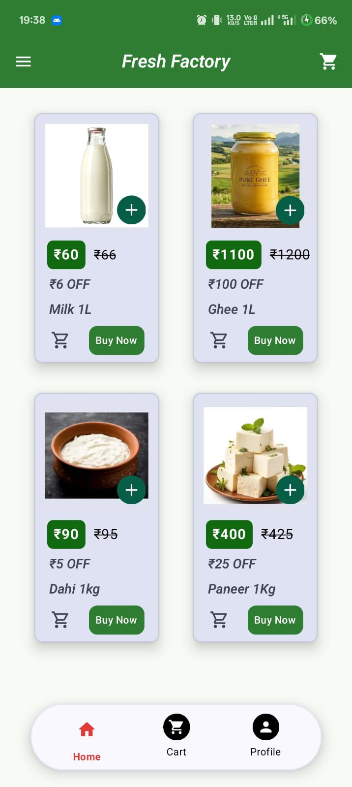
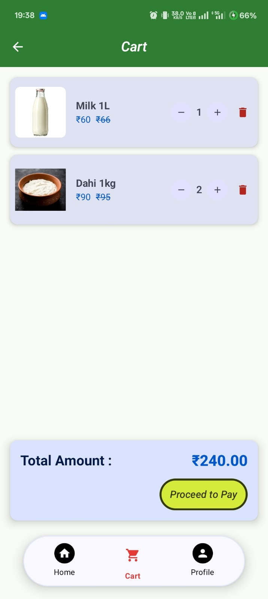
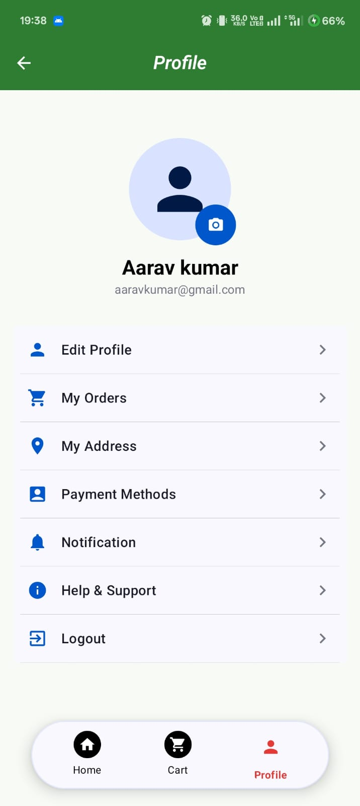

# 🥛 Fresh Factory — Fresh Dairy E-Commerce Android App

[](https://kotlinlang.org)
[](https://developer.android.com/jetpack/compose)
[](https://developer.android.com/training/data-storage/room)
[](https://developer.android.com/topic/architecture)

**Fresh Factory** is a modern, native Android application built with **Jetpack Compose (Material 3)** for ordering fresh dairy and farm products (Milk, Ghee, Curd, Paneer) directly to user doorsteps. It demonstrates clean Android architecture (**MVVM**), reactive state management using **Kotlin StateFlow**, offline persistence with **Room Database**, and image picking from **Camera & Gallery** with **Coil**.

---

## 📱 App Screenshots

<p align="center">
  
  &nbsp;&nbsp;
  
  &nbsp;&nbsp;
  
</p>

---

## ✨ Key Features

### 🛒 1. Home Dashboard & Product Catalog
- **Promotional Carousel:** Interactive banner carousel highlighting current fresh deals.
- **Dairy Products Grid:** Product catalog featuring fresh items (*Milk 1L, Pure Ghee 1L, Fresh Curd, Cottage Cheese/Paneer*).
- **Direct Action CTAs:** Quick "Add to Cart" and "Buy Now" options with real-time cart badge sync.
- **Search Bar:** Real-time search UI for finding fresh produce.

### 🛍️ 2. Dynamic Shopping Cart & Bill Breakdown
- **Reactive Cart State:** Driven by `CartViewModel` and `StateFlow`.
- **Quantity Adjustments:** Real-time `+` / `-` item counters with automatic total price calculation, discounts, and bill summary.
- **Item Removal:** Seamless swipe/button deletion for cart management.

### 👤 3. Offline Profile Management & Room Persistence
- **Local Persistence (Room DB):** User profile information (Name, Phone Number, Email) saved locally in SQLite using Room Database.
- **Profile Photo Picker (Camera & Gallery):** Material 3 `ModalBottomSheet` dashboard for selecting profile photos directly from **Camera** or **Gallery** using system launchers.
- **Async Image Loading:** Renders profile images smoothly using **Coil Compose**.
- **Settings & Account Management:** List of category options (*My Orders, My Address, Payment Methods, Notifications, Help & Support*).

### 🧭 4. Custom Floating Navigation
- Floating pill-style bottom navigation bar with active tab indicators for **Home**, **Cart**, and **Profile**.

---

## 🛠️ Tech Stack & Architecture

- **UI Framework:** [Jetpack Compose](https://developer.android.com/jetpack/compose) with Material 3 Design
- **Architecture:** MVVM (Model-View-ViewModel) + Unidirectional Data Flow (UDF)
- **Local Database:** [Room Persistence Library](https://developer.android.com/training/data-storage/room) with KSP
- **Asynchronous Programming:** Kotlin Coroutines & `StateFlow` collected via `collectAsStateWithLifecycle`
- **Image Loading:** [Coil Compose](https://coil-kt.github.io/coil/compose/)
- **Dependency Management:** Gradle Version Catalog (`libs.versions.toml`) with Kotlin DSL

---

## 📁 Project Structure

```text
com.example.freshfactory/
├── BottomAppBar/
│   ├── BottomDataModel.kt          # Bottom navigation item data class
│   └── CustomBottomNavigation.kt   # Floating pill bottom navigation composable
├── CartScreen/
│   ├── CartItem.kt                 # Cart item data model
│   ├── CartScreen.kt               # Cart UI & bill summary
│   └── CartViewModel.kt            # Cart state management
├── DataBase/
│   ├── AppDatabase.kt              # Room Database singleton
│   ├── UserDao.kt                  # Room Data Access Object (DAO)
│   └── UserProfile.kt              # Room Entity model
├── Items/
│   └── MilkBottle.kt               # Product entity model
├── ProfileScreen/
│   ├── ProfileContent.kt           # Profile UI, Edit modal & Image Picker Sheet
│   └── ProfileViewModel.kt         # Profile state management & Room DB interactions
├── ui/theme/                       # Material 3 Color palette, Typography & Theme
├── HomeScreen.kt                   # Main dashboard, top bar, & product grid
└── MainActivity.kt                 # Single Activity entry point
```

---

## 🚀 Getting Started

### Prerequisites
- **Android Studio** Ladybug (2024.2.1) or newer
- **JDK:** Java 21
- **Android SDK:** Min SDK 28 (Android 9.0) | Target SDK 37

### Installation
1. Clone the repository:
   ```bash
   git clone https://github.com/YOUR_USERNAME/MilkFactory.git
   ```
2. Open the project in **Android Studio**.
3. Let Gradle sync dependencies.
4. Run the app on an Android Emulator or Physical Device (`Shift + F10`).

---

## ⚙️ Performance Optimizations
- **R8 Code & Resource Shrinking:** Enabled in release builds (`isMinifyEnabled = true`, `isShrinkResources = true`) for a lightweight APK size.
- **Cleaned Dependencies:** Removed unused libraries for minimal build footprint.

---

## 📄 License
Distributed under the MIT License. See `LICENSE` for more information.
